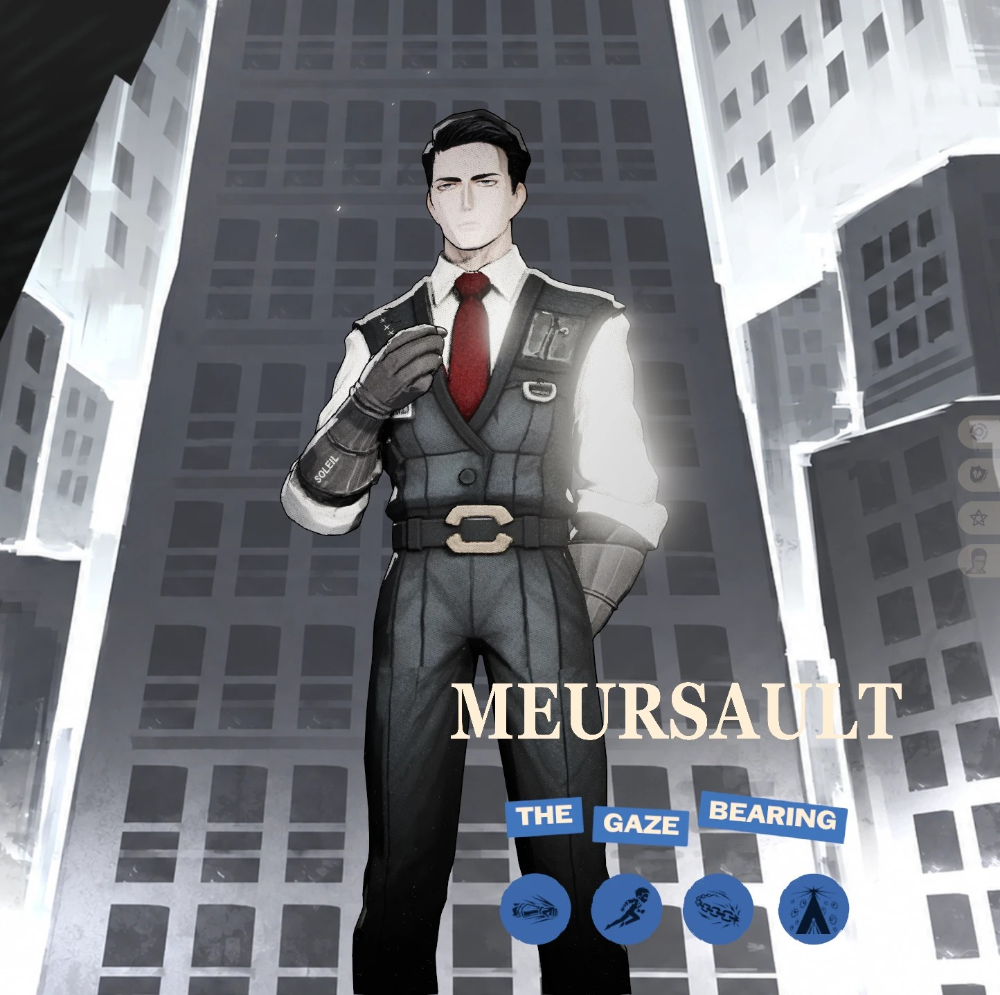
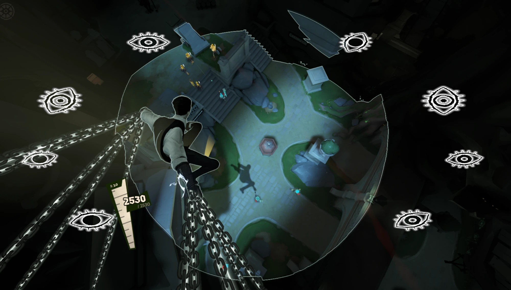
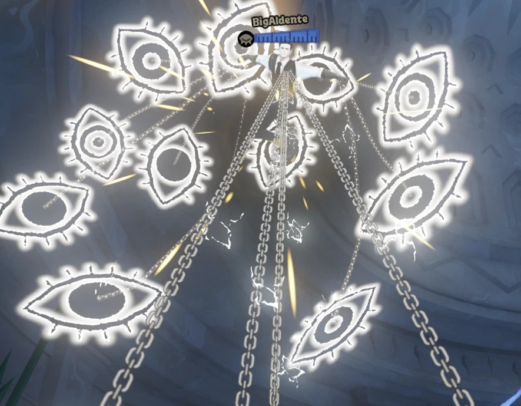
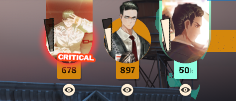

# Meursault over Lash — Deadlock mod

Meursault from **Limbus Company** replacing **Lash** in Deadlock: model, ability effects, voice and sound.

A complete character overhaul turning Lash into Meursault from Limbus Company. 

  
   Click to download the zip directly. Other files (model / effects / audio only): <a href="../../releases/latest">Releases page</a>

  
  
  
   Click any image for full size.

Features
- Meursault model replacement, fully scaled and adjusted for Deadlock.
- Custom Hero Selection screen, Gloat portrait, and Injured portrait, Map and Character icons
- Custom Ability icons and extra flavor text in the descriptions
- Audio replacements for most voicelines
- Custom sound effects - VFX Replacements for his abilities
- Bonus Custom VFX, Added unique, extra layer effects to the ult

## Install

1. Download **`Meursault_over_Lash_v1.0.zip`** from [Releases](../../releases/latest).
2. **Deadlock Mod Manager:** My Mods → **Add Local Mod** → pick the zip. (It won't appear in the manager's store; the
   store only lists GameBanana mods.)
3. **Manual:** unzip and put the `.vpk` in `Deadlock/game/citadel/addons/` (with addons set up the usual way). If
   another mod already uses `pak51`, rename it to any free `pakNN_dir.vpk`.

## Credits

- **Project Moon** ([projectmoon.studio](https://projectmoon.studio/)), *Limbus Company*: Meursault (character and
  design), voice lines and sound effects, and art.

Fan work, free, not for sale. Meursault, Limbus Company and its voices and sounds belong to Project Moon. Not affiliated
with Project Moon or Valve. Licensed **CC BY-NC-ND 4.0**.
